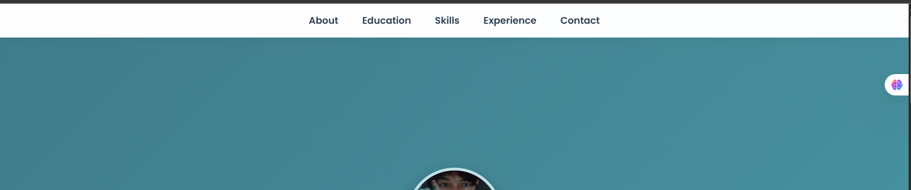

# Portofolio-Website
**Nama:** Farid Rizky Fauzan 
**Nim :** 124140210

A responsive personal portfolio website built with HTML and CSS
Personal Portfolio Website
This is my personal portfolio website built using HTML and CSS.
It showcases my profile, education, experiences, skills, and contact information in a clean and responsive design.

## Feature
- Responsive layout for desktop and mobile
- Modern glassmorphism design for skill cards
- Smooth hover animations
- Easy to customize

## file
- index.html
- style.css
- foto.jpg

## 📸 Navbar Display Demo

This navigation is designed to be responsive and user-friendly,
ensuring an optimal display across various devices.

### 🖥 Desktop View

### 📱 Mobile View

## Live demo
https://zann06.github.io/Portofolio-Website/
