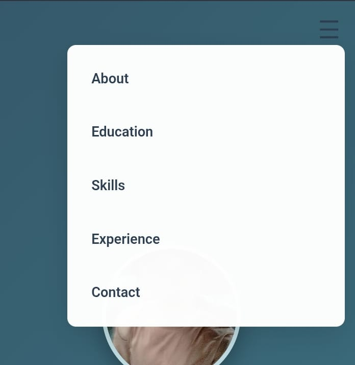

# Portfolio Website  
**Name:** Farid Rizky Fauzan  
**Student ID (NIM):** 124140210  

---

## Description  
This Portfolio Website is a responsive personal website built using HTML and CSS. It showcases my profile, education, experiences, skills, and contact information with a clean and responsive design suitable for various devices.

During the development of this project, I received valuable assistance and inspiration from the Stack Overflow community, as well as vector assets created using AI technology.

---

## Features  
- Responsive layout for both desktop and mobile devices  
- Modern glassmorphism design for skill cards  
- Smooth hover animations  
- Easy to customize  

---

## Files  
- index.html  
- style.css  
- foto.jpg  

---

## 📸 Navbar Display Demo  

This navigation is designed to be responsive and user-friendly, ensuring an optimal display across various devices.

### 🖥 Desktop View  

 

### 📱 Mobile View  
  

---

## Live Demo  
[https://zann06.github.io/Portofolio-Website/](https://zann06.github.io/Portofolio-Website/)
